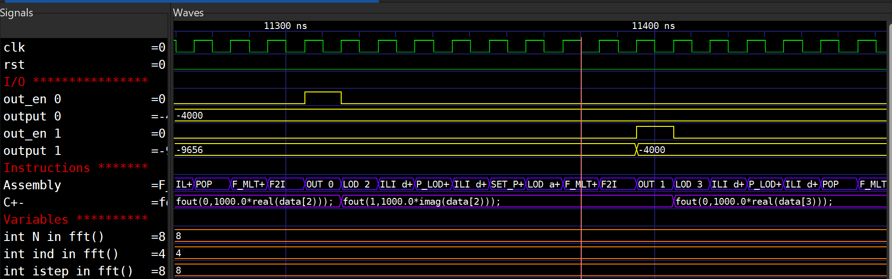

<p align="center">
  
</p>

<h1 align="center">YANC</h1>
<p align="center"><strong>Yet Another Compiler</strong> — toolchain for the SAPHO soft-processor ecosystem</p>

<p align="center">
  <a href="LICENSE"></a>
  <a href="https://github.com/nipscernlab/yanc/releases/latest"></a>
  <a href="https://github.com/nipscernlab/yanc/actions/workflows/release.yml"></a>
</p>

---

## What is YANC?

YANC is the compilation backbone of the [SAPHO](https://github.com/nipscernlab) soft-processor ecosystem. It takes a high-level program — written in either **C±** (a small C-like language with first-class fixed-point, floating-point, complex and Dirac-notation operators) or in **C++** — and compiles it all the way down to a synthesizable SAPHO core, its program/data memory images, and a ready-to-run testbench.

YANC is used by the **Aurora** desktop app, but it can also be used standalone — just call the binaries from a shell script that walks through the pipeline.

## Dependencies

YANC runs on **Windows and Linux**, and a single setup script
([`Scripts\setup.bat`](#let-the-setup-script-resolve-them-for-you) on Windows,
`Scripts/setup.sh` on Linux) checks the dependencies and helps you get the
missing ones.

On **Windows**, almost everything comes from a single install:
**[MSYS2](https://www.msys2.org/)**. Its `pacman` packages provide the build
toolchain *and* both simulators, so in practice you only install **two things**:
MSYS2 and the GTKWave build. (`setup.bat` can `pacman -S` the MSYS2 packages and
download GTKWave for you — see below.)

| Dependency | `pacman` package / source | What it's for | When you need it |
| ---------- | ------------------------- | ------------- | ---------------- |
| **MSYS2 — build toolchain** | `mingw-w64-x86_64-gcc`, `make`, `bison`, `flex` | Compiling the YANC binaries from source | Only when building from source (not when using a release zip) |
| **MSYS2 — Icarus Verilog** | `mingw-w64-x86_64-iverilog` | Simulating the generated Verilog | Default flow — `Scripts\single_proc.bat` / `multi_proc.bat` |
| **MSYS2 — Verilator** 5.x | `mingw-w64-x86_64-verilator` | Faster simulation, all user variables in the wave | `--sim verilator` flow — `Scripts\single_proc.bat --sim verilator` |
| **GTKWave** | the [nipscernlab build](https://github.com/nipscernlab/gtkwave-nipscern/releases) (separate download) | Viewing the waveform | To open the trace (any flow) |

> **Why MSYS2 for the simulators too?** `iverilog` and `verilator` are both in
> MSYS2, so a single MSYS2 install covers building *and* simulating — no separate
> Icarus/Verilator installers. The only piece outside MSYS2 is GTKWave.
>
> **GTKWave must be the nipscernlab build** — the runner scripts rely on its
> waveform-formatting behaviour; the generic GTKWave will not work the same way.
>
> ⚠️ **Avoid `mingw-w64-x86_64-gcc` 16.1.0-5.** That MSYS2 package shipped a
> broken `libstdc++` (the `std::string` move constructor symbol is missing), so
> Verilator's `verilated.cpp` fails to link and the `--sim verilator` flow dies
> with `undefined reference to std::__cxx11::basic_string<...>::basic_string(...&&)`.
> Use **gcc 15.1.0-5** (known good). `setup.bat`/`setup.sh` probe for this and
> warn you. To downgrade from the pacman cache:
> ```
> pacman -U /var/cache/pacman/pkg/mingw-w64-x86_64-gcc-15.1.0-5-any.pkg.tar.zst \
>           /var/cache/pacman/pkg/mingw-w64-x86_64-gcc-libs-15.1.0-5-any.pkg.tar.zst
> ```
> The Icarus flow is unaffected.

On **Linux**, the same dependencies come from your distribution's package
manager (`apt`, `dnf`, `pacman`, or `zypper`):

| Package | What it's for |
| ------- | ------------- |
| `gcc`, `bison`, `flex` (Debian/Ubuntu: `build-essential bison flex`) | Compiling the YANC binaries |
| `iverilog` | Default flow — `Scripts/single_proc.sh` / `multi_proc.sh` |
| `verilator` | `--sim verilator` flow — `Scripts/single_proc.sh --sim verilator` |
| `gtkwave` | Viewing the waveform |

> **Note on Linux GTKWave:** there is no Linux build of the nipscernlab fork
> yet, so the Linux flow uses your distro's stock `gtkwave`. It still opens the
> waveform and applies the generated `.gtkw` layout; only the panel chrome
> (dark SST-less view) differs from the Windows fork.

### Let the setup script resolve them for you

You don't have to install and wire these up by hand. Run **once**:

```bat
Scripts\setup.bat      :: Windows
```
```sh
bash Scripts/setup.sh  # Linux
```

It **checks** every dependency and **helps you get the missing ones**:

* finds (or, with MSYS2, offers to `pacman -S`) the `gcc` / `bison` / `flex`
  build toolchain;
* produces the YANC binaries in `bin\` — **either** keeping the `.exe` a release
  zip already shipped / downloading the prebuilt ones from the latest release
  (no build toolchain needed), **or** compiling them once from source;
* finds the simulators, offering to `pacman -S` **Icarus** and/or **Verilator**
  from MSYS2 if they're missing;
* **downloads the nipscernlab GTKWave** portable bundle if it isn't already
  present;
* remembers every resolved path so the runners need no manual configuration.

On **Linux**, `setup.sh` does the equivalent through your package manager: it
offers to install `gcc`/`bison`/`flex` and the simulators, and produces the
binaries in `bin/` — building them from source when the toolchain is present, or
downloading the prebuilt Linux tarball from the latest release when it isn't. It
uses the distro `gtkwave` and caches the paths in `Scripts/tools.local.sh` for
the runners. Re-run with `--rebuild` to recompile or `--download` to refetch.

If something can't be resolved automatically (e.g. MSYS2 itself isn't installed
yet), setup prints the exact link and command to fix it, then you re-run it. See
[Pre-wired scripts](#pre-wired-scripts) for the full description and the
`--rebuild` / `--download` flags.

## Pipeline

YANC has **three compilers** (`cmmcomp`, `cppcomp`, `asmcomp`). Two front-end compilers turn high-level source into assembly; a single back-end compiler turns that assembly into Verilog. Each compiler is preceded by an optional preprocessor (`cpppp` for C++, `appcomp` for assembly macros).

```
  C±:     foo.cmm  ─────────────────────►  cmmcomp  ─┐
                                                     ▼
                                                  foo.asm  ──►  appcomp  ──►  asmcomp  ──►  foo.v + *.mif + foo_tb.v
                                                     ▲
  C++:    foo.cpp  ──►  cpppp  ──►  cppcomp  ────────┘
```

After `asmcomp`, the generated Verilog can be simulated with **Icarus Verilog** (`iverilog` + `vvp`) or with **Verilator**, and visualized in **GTKWave**. Pre-wired scripts in `Scripts/` cover the whole pipeline end-to-end — `single_proc` (one C± processor), `multi_proc` (C± multi-processor project) and `single_proc_cpp` (one C++ processor), each with a `.bat` and a `.sh` and a `--sim iverilog|verilator` flag (default Icarus).

## What you see in GTKWave

Because the toolchain emits a side-table mapping each PC value to its
originating C± source line, GTKWave shows the executing C± line,
the assembly opcode, and every declared variable evolving in lockstep
with the simulated clock — not just raw bus toggles:



The example above is `proc_fft` mid-run: the C± track shows the
`fout(0, 1000.0*real(data[2]));` statement, the assembly track shows
the matching `LOD / F_MLT+ / F2I / OUT 0` sequence, and the
declared variables (`N`, `ind`, `istep`, `j`, `k`, `m`, `mmax`,
`sind`, `comp temp`) carry their live values.

## Components

Six binaries are produced from source — three compilers, two preprocessors, and one helper:

**Compilers**

| Binary       | Source dir              | Built with         | Role                                                |
| ------------ | ----------------------- | ------------------ | --------------------------------------------------- |
| `cmmcomp`    | `Compilers/CMMComp/`    | Flex + Bison + GCC | C± front-end → assembly                            |
| `cppcomp`    | `Compilers/CPPComp/`    | Flex + Bison + GCC | C++ front-end → assembly                            |
| `asmcomp`    | `Compilers/ASMComp/`    | Flex + GCC         | Back-end: assembly → Verilog HDL + memory images + testbench |

**Preprocessors**

| Binary       | Source dir              | Built with    | Role                                                                |
| ------------ | ----------------------- | ------------- | ------------------------------------------------------------------- |
| `cpppp`      | `Compilers/CPPComp/`    | GCC           | C++ preprocessor for `cppcomp` (`#include`, `#define`, `#if`, ...)  |
| `appcomp`    | `Compilers/APPComp/`    | Flex + GCC    | First pass over the `.asm`: records processor params + resolves variable/label addresses for `asmcomp` |

**Helper**

| Binary       | Source dir   | Built with    | Role                                                |
| ------------ | ------------ | ------------- | --------------------------------------------------- |
| `comp2gtkw`  | `Scripts/`   | GCC           | Translator: complex-number bit pattern → GTKWave    |
| `gen_gtkw`   | `Scripts/`   | GCC           | Reads a VCD header → writes a formatted `.gtkw` view |

Auxiliary content:

* `HDL/` — reusable Verilog modules (processor core, ALU, instruction decoder, FIFO, ...)
* `Compilers/CMMComp/Includes/` — assembly macros and lookup tables for `.cmm` programs (`float_sqrt`, `float_sin`, `float_atan`, ...)
* `Compilers/CPPComp/Includes/` — header shims that `.cpp` programs include
* `Scripts/` — `regress.sh`, `comp2gtkw`, `gen_gtkw` (builds the formatted GTKWave view)
* `Compilers/CMMComp/Tests/` — runnable `.cmm` example projects (Math, FFT, RLS, DTW, PulseSim, Blind, ...)
* `Compilers/CPPComp/Tests/` — per-test C++ programs (`test1` … `test51`), plus the Verilator harness
* `Compilers/yanc_version.h` — single source of truth for the toolchain version, included by all five binaries (the three compilers + the two preprocessors)

## Quick start

### 1. Get the binaries

> **Easiest path (Windows):** clone the repo and run `Scripts\setup.bat` once.
> It detects whether you have prebuilt `.exe` or the MSYS2 toolchain, then
> downloads or compiles the binaries into `bin\` and wires up the simulators +
> GTKWave for the runner scripts — see [Pre-wired scripts](#pre-wired-scripts).
> The two options below are the manual equivalents.

**Option A — pre-built (fastest).** Download the latest release from [Releases](https://github.com/nipscernlab/yanc/releases/latest) — the `yanc-bin-<tag>.zip` asset on Windows or `yanc-bin-linux-<tag>.tar.gz` on Linux — and extract it. The archive contains `bin/` (the executables incl. `comp2gtkw`/`gen_gtkw`), `HDL/`, `Macros/` (C±-side includes), and `Header/` (C++-side includes).

**Option B — build from source.**

Requirements (Windows + [MSYS2](https://www.msys2.org/)):

* The MinGW-w64 cross toolchain — install with `pacman -S mingw-w64-x86_64-gcc`. The build calls `x86_64-w64-mingw32-gcc.exe` (the cross tuple, not plain `gcc.exe`) on purpose: it produces stand-alone Windows `.exe`s with no MSYS2 DLL runtime dependency, so the deployed binaries work on any Windows machine.
* `make`, `bison` and `flex` — install with `pacman -S make bison flex`.
* These tools must be reachable on your `PATH`. The script bails early with the exact line to add if any of them is missing. Typical setup:
  ```
  set PATH=C:\msys64\mingw64\bin;C:\msys64\usr\bin;%PATH%
  ```
* Optional, only needed if you want to simulate the generated Verilog — both
  are MSYS2 packages, so they install the same way as the build toolchain:
  * [Icarus Verilog](http://iverilog.icarus.com/) (`iverilog` + `vvp`) — `pacman -S mingw-w64-x86_64-iverilog`, and/or
  * [Verilator](https://verilator.org/) **5.x** — `pacman -S mingw-w64-x86_64-verilator`. Its `--binary` mode drives the MinGW `g++` and `python3` from your `mingw64` toolchain, so keep `…\mingw64\bin` on `PATH`.
  * GTKWave — the [nipscernlab build](https://github.com/nipscernlab/gtkwave-nipscern/releases) to view the waveform.

The actual compile commands live in a single top-level **`Makefile`** (the
source of truth shared by the setup scripts, `aurora.bat`, and the CI/release
workflows). To build the binaries by hand — on Linux, or on Windows under
MSYS2:

```sh
make                              # build all into bin/
make cmmcomp                      # build one
make clean                        # remove bin/ and the flex/bison outputs
make CC=x86_64-w64-mingw32-gcc    # Windows standalone .exe (no MSYS2 DLLs)
```

On Windows `make` emits `.exe` automatically (it keys off `$(OS)`); on Linux the
binaries have no suffix. `Scripts/setup.bat` / `setup.sh` just drive this
Makefile, so you normally don't call it directly.

`Scripts/aurora.bat` builds all binaries (via the Makefile) and deploys them into a sibling `Aurora/components/` checkout. It assumes the two repos sit side by side under a common parent — no absolute paths, no editing required:

```
<parent>\
   yanc\        (this repo)
   Aurora\
      components\   <-- deploy target
```

Run it from anywhere (it derives both paths from `%~dp0`):

```bat
Scripts\aurora.bat
```

A polished `make`-style entry-point is on the to-do list; for now this batch script is the supported path on Windows. If you only need the binaries, the relevant `gcc` invocations are visible inside `Scripts/aurora.bat` — each compiler is a single `bison`/`flex` + `gcc` line.

### 2. Run the pipeline standalone

The full flow is at most six self-contained CLI steps: alternating preprocess/compile passes that take the source down to Verilog, then the simulation and viewing. Here is a minimal end-to-end script that turns a C++ source file into a Verilog testbench and runs it under Icarus Verilog — no Aurora, no `Scripts\single_proc.bat` needed:

```bat
:: --- toolchain -----------------------------------------------------------
set BIN=C:\path\to\yanc\bin
set HDL=C:\path\to\yanc\HDL
set MAC=C:\path\to\yanc\Macros
set HDR=C:\path\to\yanc\Header

:: --- user input ----------------------------------------------------------
set SRC=my_program.cpp
set NAME=my_proc
set PROJ=%CD%\out\%NAME%
set TMP=%CD%\tmp
mkdir %PROJ%\Software %PROJ%\Hardware %PROJ%\Simulation %TMP%

:: --- 1. preprocess C++ source (skip this for .cmm sources) ---------------
%BIN%\cpppp.exe   -i %SRC% -o %TMP%\pp.cpp -I %HDR%

:: --- 2. compile source -> assembly ---------------------------------------
%BIN%\cppcomp.exe -i %TMP%\pp.cpp -n %NAME% -p %PROJ% -t %TMP%
:: ...or, for a .cmm source instead (no separate preprocess step needed):
:: %BIN%\cmmcomp.exe -i %SRC% -n %NAME% -p %PROJ% -m %MAC% -t %TMP%

:: --- 3. resolve addresses + processor params -> log read by asmcomp ------
%BIN%\appcomp.exe -i %PROJ%\Software\%NAME%.asm -t %TMP%

:: --- 4. compile assembly -> Verilog HDL + memory images + testbench ------
%BIN%\asmcomp.exe -i %PROJ%\Software\%NAME%.asm -p %PROJ% ^
                  -d %HDL% -m %MAC% -t %TMP% -f 100 -c 1000000

:: --- 5. simulate (Icarus) ------------------------------------------------
iverilog -s %NAME%_tb -o %TMP%\%NAME%.vvp ^
         %HDL%\*.v %PROJ%\Hardware\%NAME%.v %PROJ%\Simulation\%NAME%_tb.v
vvp %TMP%\%NAME%.vvp -fst

:: --- 6. view waveform ----------------------------------------------------
gtkwave %TMP%\%NAME%_tb.fst
```

You can stop at step 4 if all you want are the Verilog/memory artifacts (e.g. to feed your own simulator), or swap steps 5–6 for **Verilator** (below).

### Simulating with Verilator

Verilator 5 compiles the same generated `<proc>_tb.v` directly — `--timing` understands the testbench's clock and `#` delays, so no separate C++ driver is needed:

```bat
:: --- 5b. simulate (Verilator) — alternative to steps 5–6 above ----------
verilator --binary --timing --trace +define+YANC_TRACE --top-module %NAME%_tb ^
          -Wno-lint -Wno-MULTIDRIVEN -Wno-BLKANDNBLK -Wno-COMBDLY -Wno-STMTDLY ^
          -Wno-INFINITELOOP -Wno-UNOPTFLAT --Mdir %TMP%\vl ^
          %PROJ%\Simulation\%NAME%_tb.v %PROJ%\Hardware\%NAME%.v ^
          %HDL%\processor.v %HDL%\core.v %HDL%\ula.v %HDL%\addr_dec.v %HDL%\instr_dec.v
%TMP%\vl\V%NAME%_tb.exe          :: runs the sim, writes %NAME%_tb.vcd in the CWD
gtkwave %NAME%_tb.vcd
```

**The one thing to remember:** `+define+YANC_TRACE` is what makes your variables, arrays, the PC→C± line table and the assembly opcode appear in the waveform. Icarus gets them for free (it predefines `__ICARUS__`); Verilator only compiles that visibility harness when you pass the define. For big multi-millisecond project dumps, use `--trace-fst` instead of `--trace` (compact FST; the file is still named `<tb>.vcd` and GTKWave detects the format). The trace deliberately carries only the `<proc>`-level user signals — the CPU internals below each processor are fenced out with `/* verilator tracing_off */`. **In particular the stack-monitoring flags and the ULA rounding-error taps (`fl_max`, `fl_full`, `pointeri`, `delta_int`, `delta_float`) are intentionally *not* in the Verilator VCD**: keeping them would force Verilator to evaluate the expensive real-valued ULA monitoring logic every cycle, which defeats the whole point of using Verilator (speed). Those debug signals remain available under the Icarus flow (`Scripts\single_proc.bat` / `multi_proc.bat`), where raw speed is not the goal.

### Formatting the waveform — `gen_gtkw` (optional)

After simulating with **either** Icarus or Verilator you have a raw `<tb>.vcd` /
`.fst`: every signal, in scope order, unformatted. If you want the curated view
instead — the **input/output ports**, the **Assembly** and **C±** instruction
tracks (disassembled through their translate files), and the **internal
variables and arrays** grouped per processor — build and run **`gen_gtkw`**, then
re-open the waveform with it applied via `-a`:

```bat
gcc -o gen_gtkw.exe Scripts\gen_gtkw.c                      :: build once (sibling of comp2gtkw)
gen_gtkw.exe %TMP%\%NAME%_tb.vcd %TMP%\%NAME%_tb.gtkw %TMP_BASE% comp2gtkw.exe
gtkwave --dark --zoom-fit --left-justify %TMP%\%NAME%_tb.vcd -a %TMP%\%NAME%_tb.gtkw
```

`gen_gtkw` reads only the VCD **header** (the signal list), classifies each
harness signal by name, and writes a formatted `.gtkw` save file: the right data
format / colour / alias per signal, the `trad_opcode.txt` / `trad_cmm.txt`
translators on the Assembly / C± tracks, `comp2gtkw.exe` on complex signals, and
one section per processor — any scope that owns both `valr2` and `linetabs` — so
the **same tool handles single- and multi-processor dumps**. `<tmp_base>` is the
folder whose `<proc-type>/` subdirectories hold the translate files.

Because only the header is needed, the big project FST dumps don't have to be
written in full first: run the sim once with the **`+HEADER_ONLY`** plusarg and
the testbench dumps the header, advances one tick, flushes and `$finish`es — a
tiny header VCD in milliseconds (Verilator's header FST is converted with
`fst2vcd -f`). **The runner scripts wire this whole sequence up
correctly** (header pass → `gen_gtkw` → `gtkwave -a`), so they are the reference
for using it in practice. `--zoom-fit` fits the whole trace to the window.

### Pre-wired scripts

Three scripts in `Scripts/` bundle steps 1–6 with sensible defaults. Each has a
Windows (`.bat`) and a Linux (`.sh`) version, and picks the simulator from a
`--sim iverilog|verilator` flag (default Icarus):

```bat
Scripts\single_proc      .bat / .sh   one C± processor    (edit PROC / FNAM at the top)
Scripts\multi_proc       .bat / .sh   C± multi-proc project
Scripts\single_proc_cpp  .bat / .sh   one C++ processor   (front end: cpppp -> cppcomp)

  ... default (no flag)        -> Icarus Verilog (iverilog + vvp)
  ... --sim verilator          -> Verilator (--binary --timing, +define+YANC_TRACE)
  ... --no-view                -> (single_proc_cpp) run the pipeline, skip GTKWave
```

On Linux make them executable once (`chmod +x Scripts/*.sh`) and run
`Scripts/single_proc.sh` (or `Scripts/single_proc.sh --sim verilator`).

**The C++ runner (`single_proc_cpp`)** feeds a `.cpp` program — the bundled
`Compilers/CPPComp/Tests/proc_cpp` demo — through `cpppp -> cppcomp` instead of
`cmmcomp`, then the *same* assemble / simulate / view back end. cppcomp now emits
the same files cmmcomp does (the `.asm`, `cmm_log.txt`, the `pc_<proc>_mem.txt`
PC→source line table and `trad_cmm.txt`), so the waveform looks just like the C±
flow — **with one rule**: GTKWave only shows C++ variables that live at a **fixed
data-memory address**, because the dump snoops a *constant* write address
(`if (mem_addr_wr == X)`). That covers globals, the locals/params of
non-recursive functions, and `static` locals — int shown as a raw word, float
decoded, arrays element-by-element, exactly as in C±. Stack-frame locals of
recursive functions (no fixed address), pointers (an address, not a value) and
structs (a multi-word aggregate) are deliberately **not** traced. This mirrors
C±, which — for optimization reasons — only ever allocates fixed-address
variables anyway, so both flows show the same kind of thing.

#### One-time setup — `setup.bat` / `setup.sh`

The scripts have **no hardcoded tool paths** anymore. Run the setup script
**once** and it prepares everything; the runners then just run:

```bat
Scripts\setup.bat      :: Windows
```
```sh
bash Scripts/setup.sh  # Linux  (then Scripts/single_proc.sh, ...)
```

On **Linux** `setup.sh` installs the dependencies through your package manager,
then builds the binaries from source into `bin/` (or downloads the prebuilt
Linux tarball from the release when no toolchain is present; `--download` forces
it), uses the distro `gtkwave`, and caches the paths in
`Scripts/tools.local.sh` for `Scripts/env.sh`. The rest of this section
describes the richer Windows `setup.bat`, which covers both ways of getting
YANC and picks automatically:

* **Binary mode** — if `bin\` already contains the `.exe` (e.g. you extracted a
  release zip), it keeps them; no `bison`/`flex`/`gcc` needed. If the build
  toolchain is *missing*, it offers to **download** the prebuilt binaries from
  the latest GitHub release into `bin\`.
* **Source mode** — if you cloned the repo and have the MSYS2 toolchain (or let
  setup install it via `pacman`), it **compiles** the six binaries straight into
  `bin\` once, so later runs never recompile.

It then locates the simulators and **GTKWave** (which must be the
[nipscernlab build](https://github.com/nipscernlab/gtkwave-nipscern/releases) —
setup offers to download its portable Windows bundle if missing), and caches
every resolved path in `Scripts\tools.local.bat` (gitignored). `Scripts\env.bat`
loads that cache for each runner, falling back to a `PATH` lookup for
anything not cached — so if the tools are already on your `PATH`, the scripts
work even before running setup.

Force a specific mode with `Scripts\setup.bat --rebuild` (recompile from source)
or `Scripts\setup.bat --download` (refetch the prebuilt binaries).

## CLI flags

All five binaries accept **named options** with short and long forms.
Run any of them with `-h` / `--help` for the per-tool synopsis, or
`-V` / `--version` for the version string.

`cmmcomp`, `appcomp` and `asmcomp` produce bilingual diagnostic messages:

```
-pt    Portuguese (default)
-en    English
```

Each tool's required options:

```bat
:: compilers
cmmcomp -i <file.cmm> -n <name> -p <proc-dir> -m <macros-dir> -t <temp-dir> [-A]
cppcomp -i <file.cpp> -n <name> -p <proc-dir> -t <temp-dir>
asmcomp -i <file.asm> -p <proc-dir> -d <hdl-dir> -m <macros-dir> -t <temp-dir> [-f <MHz>] [-c <clocks>]

:: preprocessors
cpppp   -i <file.cpp> -o <file.cpp> [-I <dir>]...
appcomp -i <file.asm> -t <temp-dir>
```

`-A` / `--array` (cmmcomp only) tells the toolchain to emit per-element waveform signals for declared arrays — useful when visualizing buffer contents in GTKWave.

Every short option has a long form (`--input`, `--proc-dir`, `--temp-dir`, `--macros-dir`, `--hdl-dir`, `--freq`, `--clocks`, `--name`, `--array`, …).

Example:

```bat
cmmcomp -en -i my_program.cmm -n proc_fft -p C:\proj\proc_fft -m C:\Macros -t C:\Temp\proc_fft
```

## Example C±

```c
#PRNAME Sqrt
#NUBITS 32
#NBMANT 23
#NBEXPO 8
#NUIOIN 1
#NUIOOU 1

float my_sqrt(float num)
{
    if (num == 0.0) return 0.0;

    int v = (((num << 1) >>> 24) + 22) >>> 1;         // get the exponent
        v = ((((v-22) << 23) + (1 << 22)) << 1) >> 1; // build the float

    float x; copy(v,x);

    x = 0.5 * (x + num/x);   // 4 Newton-Raphson iterations
    x = 0.5 * (x + num/x);
    x = 0.5 * (x + num/x);
    x = 0.5 * (x + num/x);

    return x;
}

void main()
{
    float x[1000] "sqrt_x.txt";
    float a[1000] "sqrt_y.txt";
    float y, t, e;
    int   j = 0;
    while (j < 1000)
    {
        y = sqrt(x[j]);     // built-in (uses macro from CMMComp/Includes/float_sqrt.asm)
        t = a[j];
        e = t - y;
        j++;
    }
}
```

More examples in `CMMComp/Tests/` and `CPPComp/Tests/`.

## Project layout

```
yanc/
├── Compilers/
│   ├── APPComp/          appcomp sources (Headers/ + Sources/)
│   ├── ASMComp/          asmcomp sources (Headers/ + Sources/)
│   ├── CMMComp/          cmmcomp sources + Includes/ (macros) + Tests/ (per-proc projects)
│   ├── CPPComp/          cpppp + cppcomp sources + Includes/ (C++ shims) + Tests/ (per-test programs + Verilator/)
│   └── yanc_version.h    single-source-of-truth toolchain version
├── HDL/                  reusable Verilog modules (core, ALU, decoders, FIFO, ...)
├── Makefile              single source of truth for building the binaries (Linux + MSYS2)
├── Scripts/              setup.bat/.sh + env.bat/.sh, aurora.bat, regress.sh,
│                         comp2gtkw, gen_gtkw, and the pre-wired runner scripts:
│                           single_proc     .bat/.sh  C± single-processor pipeline
│                           multi_proc      .bat/.sh  C± multi-processor project
│                           single_proc_cpp .bat/.sh  C++ single-processor pipeline
├── docs/images/          README assets (GTKWave screenshot, ...)
└── .github/workflows/    CI (Windows + Linux build/smoke; release on tag push)
```

## Contributing

Issues and pull requests are welcome. See [CONTRIBUTING.md](CONTRIBUTING.md)
for the conventions on commits, comments, and the bilingual `MSG_*`
diagnostic pattern.

## License

MIT — see [LICENSE](LICENSE).
